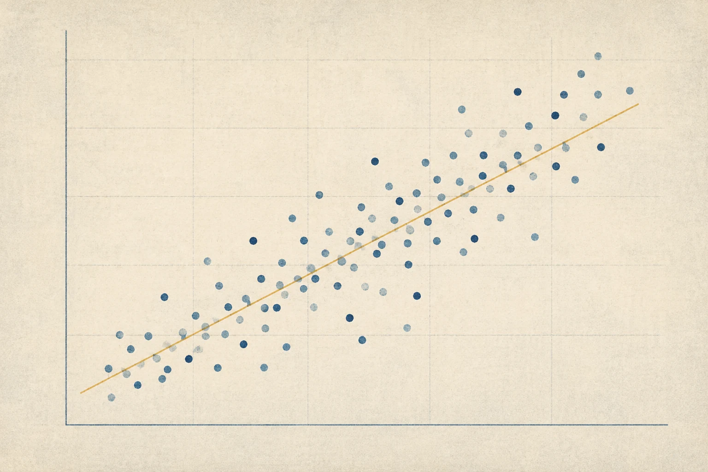
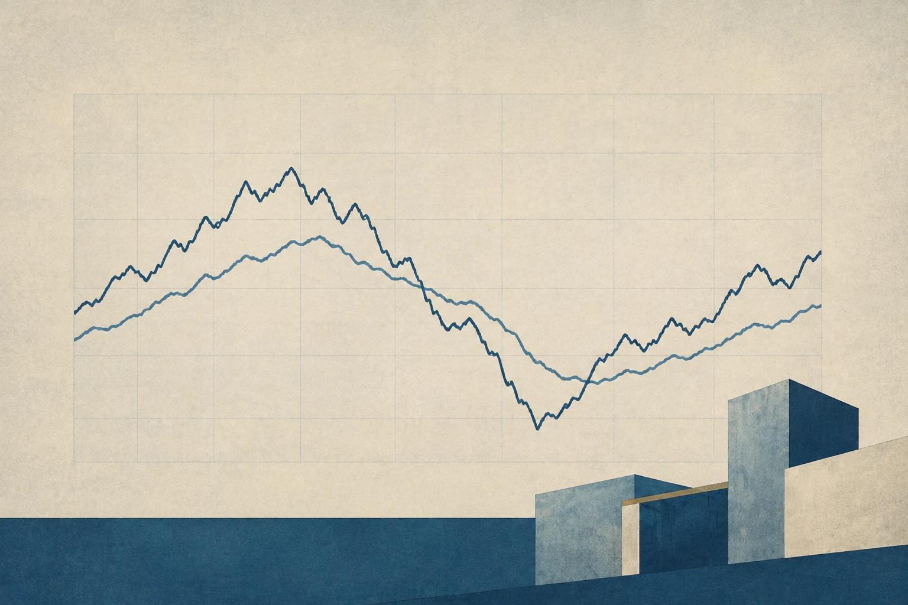

::: {.hero .column-screen}
{fig-alt=""}

# Economia, cidades e dados, aprendidos em R com casos brasileiros.
:::

::: {.wrap}
```{=html}
<nav class="strip" aria-label="Seções">
<a class="strip-item" href="tutoriais/index.html">
<span class="tile-media"></span>
<span class="strip-label">Tutoriais</span>
</a>
<a class="strip-item" href="graficos/index.html">
<span class="tile-media"></span>
<span class="strip-label">Gráficos</span>
</a>
<a class="strip-item" href="cursos.html">
<span class="tile-media"></span>
<span class="strip-label">Cursos</span>
</a>
<a class="strip-item" href="livros.html">
<span class="tile-media"></span>
<span class="strip-label">Livros</span>
</a>
<a class="strip-item" href="sobre.html">
<span class="tile-media"></span>
<span class="strip-label">Sobre</span>
</a>
</nav>
```
:::

::: {.wrap .block}
::: {.section-head}
## Gráficos recentes

[Ver todos](graficos/index.qmd)
:::

::: {#graficos-recentes .tiles .tiles-3}
:::
:::

::: {.wrap .block}
::: {.section-head}
## Tutoriais

[Ver todos](tutoriais/index.qmd)
:::

::: {#tutoriais-recentes .tiles .tiles-3}
:::
:::

::: {.band-linho .column-screen}
A Academy é a frente de ensino da [EKIO](https://ekio.io), consultoria de economia e dados.
:::
