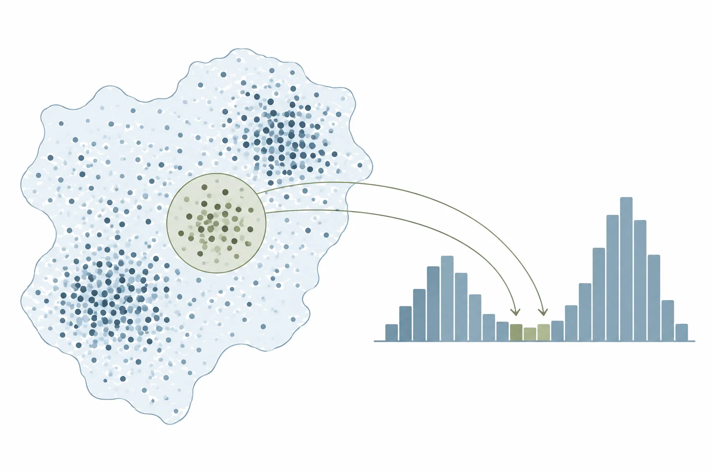
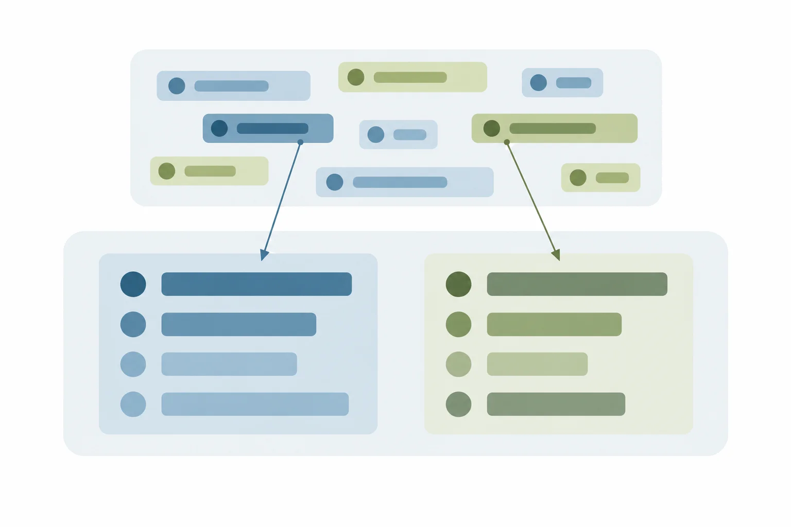

::: {.page-intro}
# Livros

Os livros estão em preparação e serão publicados abertos, em formato web.
:::

::: {.wrap .tiles .tiles-2 .offer-list}
::: {.offer #r-para-economia-urbana}
{fig-alt=""}

## R para economia urbana

Como medir preços, densidade e acesso nas cidades brasileiras com R.

[Em preparação]{.tile-meta}
:::

::: {.offer #guia-de-dados-brasileiros}
{fig-alt=""}

## Guia de dados brasileiros

Onde estão os dados públicos do Brasil e como importá-los no R.

[Em preparação]{.tile-meta}
:::
:::
