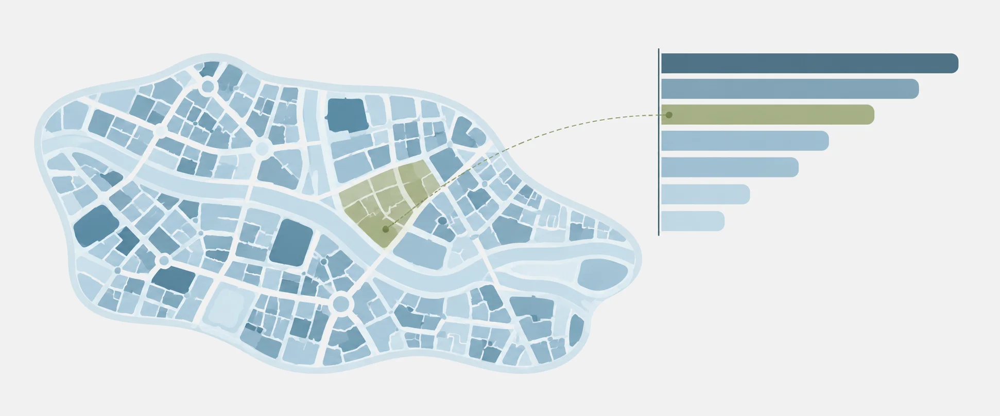

::: {.hero .column-screen}
{fig-alt=""}
:::

::: {.prose}
# Sobre

A EKIO Academy publica tutoriais de R, gráficos comentados e, em breve, cursos e livros sobre economia aplicada. Os exemplos usam dados brasileiros: Censo, pesquisas do IBGE, séries do Banco Central, mercado imobiliário e mobilidade urbana.

A Academy é a frente de ensino da [EKIO](https://ekio.io), consultoria de economia e dados. Quem escreve é Vinicius Oike, economista com mestrado pela USP e fundador da EKIO. Ele também mantém os pacotes de R [realestatebr](https://github.com/viniciusoike/realestatebr), [trendseries](https://github.com/viniciusoike/trendseries), [metrosp](https://github.com/viniciusoike/metrosp) e [ekioplot](https://github.com/viniciusoike/ekioplot).

Sugestões e correções são bem-vindas em [contato@ekio.io](mailto:contato@ekio.io).
:::
